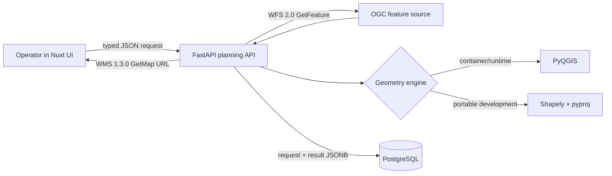

# Network Offer Geodata Workbench

[](https://github.com/Praharsh-Projects/network-offer-geodata-workbench/actions/workflows/ci.yml)

A public, self-contained full-stack reference for evaluating synthetic network-service corridors against demand locations. It uses OGC WFS/WMS contracts, projected geometry processing, a Nuxt operator interface, PostgreSQL audit storage, and Linux containers.

The repository is an independent portfolio project. It does **not** use T-Systems, Deutsche Telekom, customer, or production network data, and it does not claim access to AMY, Mercury, NOR-Pass, Camunda, or internal geo-server components.

## What the workflow proves

- Python 3 / FastAPI orchestration of concurrent WFS 2.0 feature retrieval.
- A real PyQGIS adapter using `QgsGeometry` and `QgsCoordinateTransform`, plus a portable Shapely engine for local development.
- Correct WMS 1.3.0 `EPSG:4326` axis-order construction.
- GeoJSON validation, projection to `EPSG:25830`, distance/length calculations, deterministic ranking, and inspectable recommendation evidence.
- Vue 3 / Nuxt 3 / TypeScript / SCSS operator UI served by a Node.js Nitro runtime.
- PostgreSQL JSONB persistence for request/result audit records.
- Pytest, Vitest, Playwright, type checks, dependency audits, container builds, and dedicated PyQGIS/PostgreSQL CI jobs.

## Architecture



See [architecture](docs/architecture.md) and [OGC contracts](docs/ogc-contracts.md) for the decision boundaries.

## Quick start

Prerequisites: Python 3.12, Node.js 22, and pnpm 10.28.1.

```bash
make setup
make dev-backend
```

In a second terminal:

```bash
make dev-frontend
```

Open <http://127.0.0.1:3000>. The default backend serves synthetic Granada fixtures at WFS/WMS-compatible endpoints, so no external account is required.

## Verification

```bash
make test
make test-e2e
make audit
make build
```

Local core verification on 2026-07-21 produced:

- 47 Python tests passed (3 environment-specific tests deselected), with 98.64% branch coverage.
- 5 Vitest tests passed, with 100% statement/line/function and 81.96% branch coverage.
- 1 Chromium Playwright workflow passed, including the Node runtime health route.
- Nuxt production build and live desktop/mobile browser checks passed; the live fixture flow recommended `SEG-EAST` from three candidates.

PyQGIS and PostgreSQL are intentionally separate environment gates. CI executes them inside the QGIS 3.40 LTR container and PostgreSQL 16 service respectively. See [testing](docs/testing.md) and [verification](docs/verification.md).

## Containers

```bash
docker compose up --build
```

This starts PostgreSQL, the QGIS-backed API on port 8000, and the Node/Nuxt client on port 3000. Local Docker was not available during initial development; the public CI container builds are the authoritative container evidence.

## API surface

- `GET /health` and `GET /ready`
- `POST /api/v1/offers/evaluate`
- `GET /api/v1/offers/history`
- `GET /fixtures/wfs` for self-contained WFS capabilities/features
- `GET /fixtures/wms` for self-contained WMS capabilities/map preview
- `GET /docs` for OpenAPI
- Frontend `GET /api/runtime` for the Node/Nitro server contract

## Limits

- Fixture data is synthetic and deliberately small; the workbench is not a capacity-planning product.
- The PostgreSQL boundary stores JSONB audit records; this project does not claim PostGIS usage.
- The fixture WFS/WMS routes implement only the operations required for deterministic evaluation and testing, not complete OGC servers.
- Production concerns such as SSO, secrets management, observability backends, and managed deployment remain outside this reference implementation.
